# Pertemuan 1

# Table of contents

- [Intro](#intro)
  - [Apa itu NextJS?](#apa-itu-nextjs)
  - [Kenapa Typescript dan TailwindCSS?](#kenapa-typescript-dan-tailwindcss)
- [React with Typescript Fundamentals](#react-with-typescript-fundamentals)
    - [Components](#component)
        - [Functional Components](#functional-components)
        - [Stateful Class Components](#stateful-class-components)
    - [Children](#children)
    - [Events](#events)
        - [Basic Event Handling](#basic-event-handling)
    - [Hooks Refresher with Typescript](#hooks-refresher-with-typescript)
        - [useState](#usestate)
        - [useEffect](#useeffect)
        - [useContext](#usecontext)
        - [useRef](#useref)
        - [useMemo and useCallback](#usememo-andusecallback)
        - [useState](#usestate)
- [Apa Hubungan antara React dan Next?](#apa-hubungan-antara-react-dan-next)
    - [CRA dan CNA?](#cra-dan-cna)
    - [Client Side Rendering vs Server Side Rendering vs Static Site Generation](#client-side-rendering-vs-server-side-rendering-vs-static-side-generation)
    - [getStaticProps & getServerSideProps](#getstaticprops-&-getserversideprops)
- [Hands on NextJS with Typescript and TailwindCSS](#hands-on-nextjs-with-typescript-and-tailwindcss)
    - [Inisiasi Proyek](#inisiasi-proyek)
    - [Struktur File](#struktur-file)
    - [Simple Page App](#simple-page-app)
        - [Layout](#layout)
        - [Content](#content)
    - [Modularisasi](#modulatisasi)
- [Challenge Buat Kalian!](#challenge-buat-kalian)
- [Referensi](#referensi)


<br>

# Intro
## Apa itu NextJS?
 <br>
Next.js adalah sebuah kerangka kerja (framework) React yang digunakan untuk membangun aplikasi web berbasis JavaScript. Next.js menyediakan fitur-fitur seperti rendering sisi server (server-side rendering), pre-rendering statis (static pre-rendering), pengelolaan rute (routing), dan lain-lain yang memudahkan pengembangan aplikasi web. Next.js juga dapat diintegrasikan dengan berbagai macam teknologi seperti GraphQL, TypeScript, dan TailwindCSS.
## Kenapa Typescript dan TailwindCSS?
Next.js, TypeScript, dan TailwindCSS adalah teknologi-teknologi yang dapat saling melengkapi. Kombinasi teknologi tersebut dapat memudahkan kita dalam pengembangan aplikasi web modern karena:
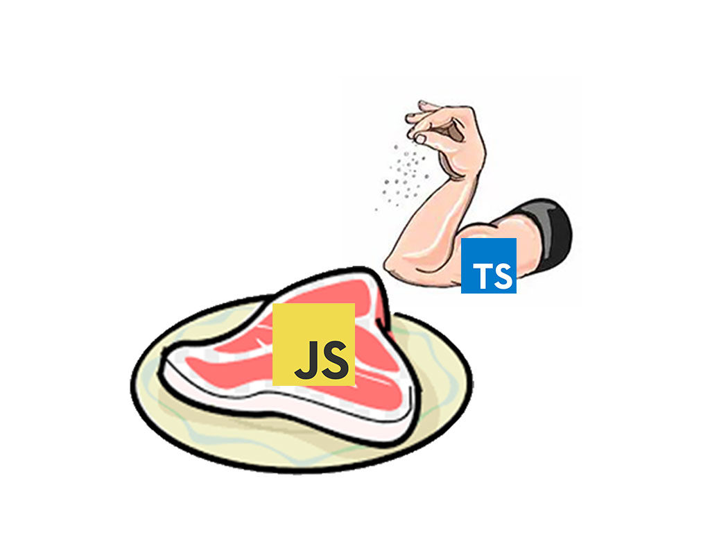 <br>
1. TypeScript merupakan sebuah bahasa pemrograman yang dapat membantu dalam pengembangan aplikasi web yang kompleks, dengan menyediakan fitur-fitur seperti tiping yang memudahkan dalam debugging dan mencegah kesalahan saat runtime. TypeScript memperkuat tipe data dalam penulisan kode, memberikan manfaat seperti mengurangi kesalahan penulisan kode, dokumentasi yang lebih baik, dan kemampuan untuk melakukan refactor secara aman
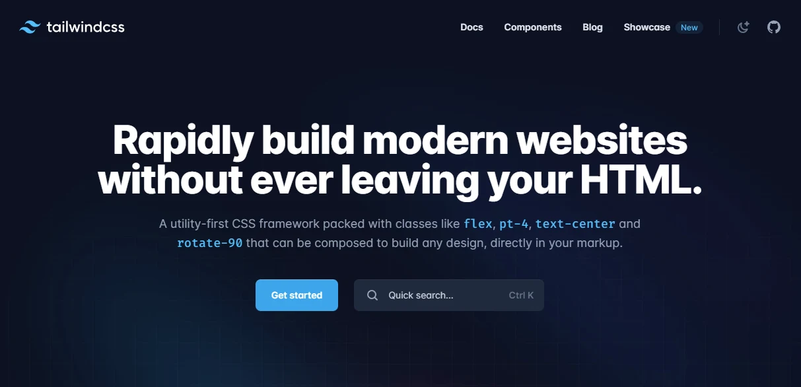 <br>
2. TailwindCSS adalah sebuah framework CSS yang menyediakan kumpulan kelas-kelas CSS yang dapat digunakan untuk mempercepat pengembangan antarmuka aplikasi. TailwindCSS juga memungkinkan kita untuk membuat desain antarmuka yang konsisten dan mudah diubah tanpa perlu "meninggalkan HTML".
# React with Typescript Fundamentals
Penggunaan React dengan Typescript menyediakan performa lebih cepat daripada dengan Javascript karena sistem tipe datanya. Typescript memiliki *static typing* yang membantu *compiler* untuk memastikan code yang ditulis oleh programmer benar. 
## Components
1. Functional Components <br>
Contoh:
```tsx
import React from 'react';

type CardProps = {
  title: string,
  paragraph: string
}

export const Card = ({ title, paragraph }: CardProps) => <aside>
  <h2>{ title }</h2>
  <p>
    { paragraph }
  </p>
</aside>

const el = <Card title="Avatar" paragraph="The Legend of Aang" />
```
Bagaimana jika tidak menggunakan semua properti?
```tsx
const el = <Card title="Avatar"/>
```
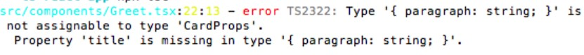 <br>
Solusinya:
```tsx
type CardProps = {
  title: string,
  paragraph?: string //paragraph menjadi opsional
}
```

```tsx
const el = <Card title="Avatar"/>
```

2. Stateful Class Components <br>

Class Component adalah salah satu jenis komponen dalam React yang ditulis menggunakan sintaks class ES6. Mereka digunakan untuk membuat komponen yang lebih kompleks dengan state, lifecycle methods, dan metode kelas. <br>
Untuk membuat sebuah Class Component, kita membuat kelas JavaScript yang mewarisi sifat dari React.Component, dan kemudian menentukan metode render() yang mengembalikan elemen React.
```tsx
import React, { Component } from 'react';

class Greeting extends Component {
  render() {
    return <h1>Hello, {this.props.name}!</h1>;
  }
}
```

Di atas adalah contoh Class Component yang menerima prop "name" dan mengembalikan elemen "h1" yang berisi pesan salam. <br>
Class Component memiliki state dan lifecycle methods yang memungkinkan kita untuk mengubah perilaku komponen dan memperbarui tampilan ketika terjadi perubahan. Namun, karena sintaksnya lebih kompleks dan memiliki lebih banyak boilerplate code, Class Component tidak lagi disarankan untuk digunakan dalam pengembangan React terbaru, dan digantikan dengan Functional Component dengan menggunakan Hooks.

## Children
Dalam React, prop children adalah prop bawaan yang memungkinkan kita untuk menyertakan elemen dan komponen sebagai children dari komponen induk. Dalam kasus prop children yang lebih kompleks, fungsi destrukturisasi dapat digunakan untuk mengakses prop children dengan lebih mudah.

Contoh, pertimbangkan komponen berikut:
```tsx
function Card({ title, children }) {
  return (
    <div className="card">
      <h2>{title}</h2>
      <div className="content">{children}</div>
    </div>
  );
}

```
Untuk mengakses prop children, kita dapat menentukan children di antara kurung kurawal {} dalam prop destrukturisasi, seperti berikut:
```tsx
function Card({ title, children }) {
  const { heading, content } = children;
  return (
    <div className="card">
      <h2>{title}</h2>
      <div className="content">
        <h3>{heading}</h3>
        {content}
      </div>
    </div>
  );
}

```
Dalam contoh di atas, prop children di-destrukturisasi menjadi dua prop terpisah, heading dan content, yang kemudian digunakan untuk memperbarui tampilan komponen. Ini dapat membuat kode lebih mudah dibaca dan dipahami, terutama jika prop children memiliki struktur yang lebih kompleks.
## Event
1. Basic Event Handling <br>
React menggunakan sistem event sendiri. Itulah mengapa kita tidak dapat menggunakan MouseEvents atau yang serupa pada sebuah elemen. Kita perlu menggunakan versi React yang spesifik, jika tidak kita akan mendapatkan error saat melakukan kompilasi.
<br>
Beruntungnya, tipe data React memberikan hal yang sesuai dengan setiap event yang mungkin sudah Anda kenal dari standar DOM. Mereka bahkan memiliki nama yang sama, yang kadang bisa membingungkan. Anda harus secara spesifik menentukan misalnya React.MouseEvent atau mengimpor tipe data MouseEvent langsung dari modul React.

```tsx
import React, { Component, MouseEvent } from 'react';

function Button({ children }){
  handleClick(event: MouseEvent) {
    event.preventDefault();
    alert(event.currentTarget.tagName); // alerts BUTTON
  }
  
  render() {
    return <button onClick={this.handleClick}>
      {this.props.children}
    </button>
  }
}
```
Event yang disediakan adalah AnimationEvent, ChangeEvent, ClipboardEvent, CompositionEvent, DragEvent, FocusEvent, FormEvent, KeyboardEvent, MouseEvent, PointerEvent, TouchEvent, TransitionEvent, WheelEvent dll.

## Hooks Refresher with Typescript
1. useState <br>
`useState` adalah hook dalam React yang memungkinkan kita untuk menambahkan state pada komponen fungsional. Dengan `useState`, kita dapat membuat dan memperbarui state dari sebuah komponen fungsional. <br>
`useState` menerima satu argumen yaitu nilai awal dari state tersebut, dan mengembalikan sebuah array dengan dua elemen, yaitu nilai dari state tersebut dan fungsi untuk memperbarui state tersebut.<br>
Contoh penggunaan `useState`:
```tsx
import React, { FunctionComponent, useState } from 'react';

// our components props accept a number for the initial value
function Counter({ initial = 0 } : number) => {
  // since we pass a number here, clicks is going to be a number.
  // setClicks is a function that accepts either a number or a function returning
  // a number
  const [clicks, setClicks] = useState(initial);
  return <>
    <p>Clicks: {clicks}</p>
    <button onClick={() => setClicks(clicks+1)}>+</button>
    <button onClick={() => setClicks(clicks-1)}>-</button>
  </>
}
```
2. useEffect <br>
`useEffect` adalah hook dalam React yang memungkinkan kita untuk melaksanakan efek samping (side effect) dalam komponen fungsional. Efek samping dapat berupa pengiriman permintaan HTTP, manipulasi DOM, pengiriman pesan ke konsol, dan lain sebagainya (`componentDidUpdate`, `componentDidMount`, `componentWillUnmount`). <br>
`useEffect` menerima dua argumen, yaitu sebuah fungsi callback dan sebuah array dependencies opsional. Fungsi callback tersebut akan dieksekusi setiap kali komponen dirender ulang, dan array dependencies digunakan untuk mengoptimalkan performa. <br>
Contoh penggunaan `useEffect`:

```tsx
import React, { useState, useEffect } from 'react';

interface CounterProps {
  initialValue: number;
}

function Counter({ initialValue }: CounterProps) {
  const [count, setCount] = useState<number>(initialValue);

  useEffect(() => {
    document.title = `Count: ${count}`;
  }, [count]);

  function handleClick() {
    setCount(count + 1);
  }

  return (
    <div>
      <p>Count: {count}</p>
      <button onClick={handleClick}>Increment</button>
    </div>
  );
}

```
Di sini, kita menentukan tipe data dari state `count` dengan menambahkan `: number` setelah pemanggilan `useState`. Kita juga menentukan tipe data dari prop `initialValue` dengan membuat sebuah interface `CounterProps` dan menggunakan tipe data tersebut pada parameter fungsi `Counter`.

3. useContext <br>
`useContext` memungkinkan kita untuk mengakses properti konteks dari mana saja di dalam sebuah komponen. Seperti halnya `Context.Consumer` pada komponen kelas.

```tsx
import React, { useContext } from 'react';

// our context sets a property of type string
export const LanguageContext = React.createContext({ lang: 'en' });

const Display = () => {
  // lang will be of type string
  const { lang } = useContext(LanguageContext);
  return <>
    <p>Your selected language: {lang}</p>
  </>
}

```

4. useRef <br>
`useRef` adalah hook yang digunakan untuk membuat objek referensi dan mempertahankannya di seluruh siklus hidup komponen. `useRef` mengembalikan objek yang memiliki properti .current, yang akan terus mempertahankan nilai yang dilewatkan ke dalamnya. Perubahan nilai pada .current tidak akan memicu re-render komponen. <br>
Untuk menggunakan `useRef` dengan TypeScript, Anda dapat menentukan tipe data dari nilai awal pada `useRef` atau membiarkan TypeScript untuk menginferensinya secara otomatis. <br>
Contoh penggunaan `useRef` dengan TypeScript:

```tsx
import React, { useRef } from 'react';

function Example() {
  const inputRef = useRef<HTMLInputElement>(null);

  function handleFocus() {
    if (inputRef.current) {
      inputRef.current.focus();
    }
  }

  return (
    <div>
      <input type="text" ref={inputRef} />
      <button onClick={handleFocus}>Focus</button>
    </div>
  );
}

```

Di sini, kita menentukan tipe data dari objek referensi yang dibuat dengan `useRef` menggunakan sintaksis generic `useRef<HTMLInputElement>(null)`. Kita juga memastikan untuk memeriksa apakah nilai `.current` tidak null sebelum memanggil metode `.focus()` pada elemen yang direferensikan.

5. useMemo and useCallback <br>

`useMemo` dan `useCallback` adalah dua hook yang digunakan untuk mengoptimalkan kinerja aplikasi dengan menghindari re-kalkulasi yang tidak perlu atau re-render yang tidak perlu. <br>
`useMemo` digunakan untuk menyimpan nilai yang dihitung dalam komponen, sehingga nilai tersebut hanya dihitung ulang saat terjadi perubahan pada salah satu dependensinya. <br>
Contoh penggunaan `useMemo` dengan TypeScript:

```tsx
import React, { useMemo } from 'react';

function Example(props: { count: number }) {
  const result = useMemo(() => {
    return computeExpensiveValue(props.count);
  }, [props.count]);

  return <div>Result: {result}</div>;
}

```

Di sini, kita menggunakan useMemo untuk menghitung nilai result hanya saat prop count berubah.

`useCallback` digunakan untuk menyimpan referensi fungsi yang dibuat di dalam komponen, sehingga fungsi tersebut hanya dibuat ulang saat terjadi perubahan pada salah satu dependensinya. Contoh penggunaan `useCallback` dengan TypeScript:

```tsx
import React, { useCallback } from 'react';

function Example(props: { onClick: () => void }) {
  const handleClick = useCallback(() => {
    console.log('Button clicked!');
    props.onClick();
  }, [props.onClick]);

  return <button onClick={handleClick}>Click me</button>;
}

```
Di sini, kita menggunakan `useCallback` untuk membuat referensi `handleClick` hanya saat terjadi perubahan pada prop `onClick`.

6. useReducer <br>

`useReducer` adalah hook yang digunakan untuk mengelola state kompleks yang memiliki banyak kasus penggunaan. `useReducer` mirip dengan useState, namun dengan sintaksis dan penggunaan yang berbeda. Pada dasarnya, `useReducer` menerima reducer function yang mengembalikan state baru berdasarkan action yang diterima.
<br>
Untuk menggunakan `useReducer` dengan TypeScript, Anda perlu menentukan tipe data dari state awal, action, dan state yang dihasilkan oleh reducer function. <br>
Contoh penggunaan `useReducer` dengan TypeScript:

```tsx
import React, { useReducer } from 'react';

type State = {
  count: number;
};

type Action =
  | { type: 'increment' }
  | { type: 'decrement' }
  | { type: 'reset'; payload: number };
//set the type here ...
function reducer(state: State, action: Action): State {
  switch (action.type) {
    // ... memastikan tidak ada string ...
    case 'increment':
      return { count: state.count + 1 };
    case 'decrement':
      return { count: state.count - 1 };
    case 'reset':
      return { count: action.payload };
    default:
      throw new Error('Invalid action type');
  }
}

function Example() {
  const [state, dispatch] = useReducer(reducer, { count: 0 });

  function handleReset() {
    dispatch({ type: 'reset', payload: 0 });
  }

  return (
    <div>
      <div>Count: {state.count}</div>
      <button onClick={() => dispatch({ type: 'increment' })}>Increment</button>
      <button onClick={() => dispatch({ type: 'decrement' })}>Decrement</button>
      <button onClick={handleReset}>Reset</button>
    </div>
  );
}

```

Di sini, kita menentukan tipe data `State` dan `Action`, kemudian membuat reducer function yang menerima `state` dan `action`  dan mengembalikan state baru berdasarkan action yang diterima. Setelah itu, kita menggunakan `useReducer` untuk membuat state dan dispatch function, kemudian menggunakan dispatch function untuk memicu perubahan state.

# Apa Hubungan antara React dan Next?
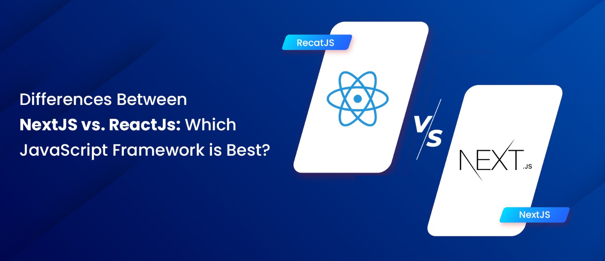 <br>
React adalah library JavaScript yang digunakan untuk membangun antarmuka pengguna (user interface) pada aplikasi web. Sedangkan Next.js adalah sebuah framework React yang memperluas fungsionalitas React dengan menambahkan berbagai fitur yang umumnya dibutuhkan untuk membangun aplikasi web modern, seperti server-side rendering, static site generation, routing, dan masih banyak lagi.
<br><br>
Dengan Next.js, pengguna React dapat dengan mudah mengoptimalkan aplikasi web mereka untuk kecepatan, SEO, dan pengalaman pengguna yang lebih baik dengan fitur-fitur yang disediakan. Selain itu, Next.js juga memudahkan developer untuk membangun aplikasi web yang kompleks dengan struktur folder yang jelas dan dukungan TypeScript out-of-the-box.
<br><br>
Jadi, secara singkat, Next.js memanfaatkan React sebagai basisnya dan menambahkan fitur-fitur tambahan yang memudahkan pengembangan aplikasi web.

## CRA dan CNA?
Meskipun `create-react-app` dan `create-next-app` adalah perangkat yang berbeda, keduanya adalah alat yang berguna untuk memulai proyek React. Namun, ada beberapa alasan mengapa seseorang mungkin ingin memilih `create-next-app` daripada `create-react-app`:

1. **Server-side rendering (SSR)**: `create-next-app` menyediakan dukungan SSR out-of-the-box, yang memungkinkan aplikasi web untuk lebih cepat dimuat, dan meningkatkan pengalaman pengguna dan SEO.
2. **Static site generation (SSG)**: `create-next-app` juga mendukung SSG, yang memungkinkan developer untuk membangun situs statis yang cepat dan aman, tanpa perlu menjalankan server.
3. **File-based routing**: `create-next-app` memungkinkan pengembang untuk membuat rute file-based secara langsung, yang memudahkan pengembangan aplikasi web skala besar.
4. **Dukungan TypeScript out-of-the-box**: `create-next-app` sudah mempunyai dukungan TypeScript terintegrasi, yang memudahkan pengembang untuk mengembangkan aplikasi web yang lebih aman dan terstruktur.
5. **Bebas konfiguras**i: `create-next-app` menyediakan konfigurasi yang sudah siap pakai, sehingga pengembang tidak perlu menghabiskan banyak waktu untuk mengonfigurasi lingkungan kerja mereka. Hal ini memungkinkan pengembang untuk lebih fokus pada pengembangan aplikasi web mereka.

Jadi, `create-next-app` sangat cocok untuk proyek-proyek React yang kompleks atau memerlukan dukungan SSR atau SSG, dan ingin memulai proyek dengan cepat tanpa perlu menghabiskan banyak waktu untuk konfigurasi awal. Namun, jika proyekkalian hanya memerlukan basis React yang sederhana, `create-react-app` mungkin sudah cukup untuk kebutuhan Anda.

## Client Side Rendering vs Server Side Rendering vs Static Site Generation

### **CSR** <br>
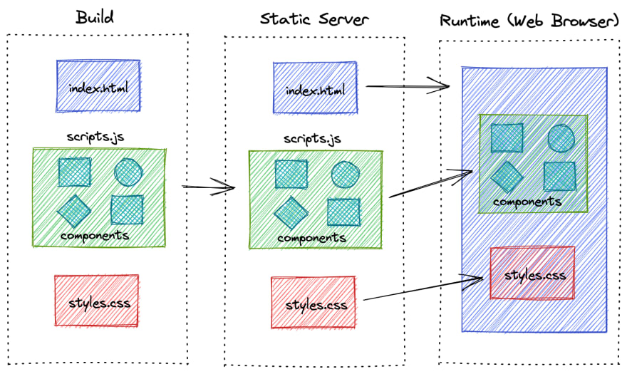 <br>
Pada **Client-Side Rendering**, halaman-halaman web dibangun pada sisi klien (browser) dengan menggunakan JavaScript. Data diambil dari server melalui permintaan HTTP (misalnya, REST API) pada waktu runtime ketika pengguna mengakses halaman-halaman tersebut. Dalam hal ini, waktu muat (loading) halaman mungkin lebih lambat karena halaman harus dibangun setiap kali pengguna mengaksesnya. <br>
### **SSR** <br>
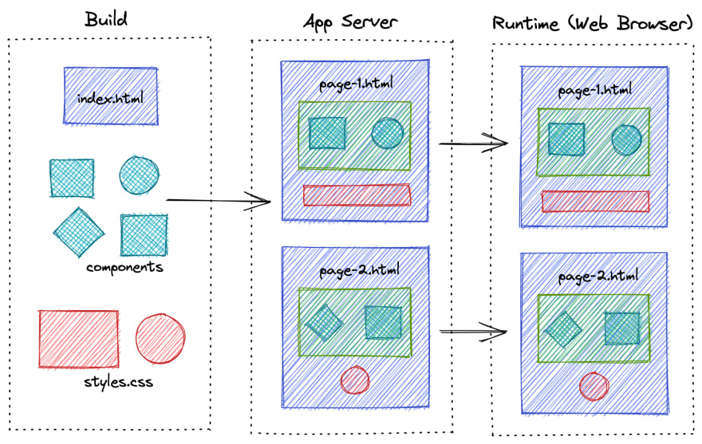 <br>
Pada **Server-Side Rendering** , halaman-halaman web dibangun pada sisi server dengan menggunakan JavaScript. Data diambil dari server pada saat render dilakukan, dan halaman HTML dihasilkan dan dikirimkan ke browser pengguna. Dalam hal ini, waktu muat (loading) halaman menjadi lebih cepat karena halaman sudah dibangun sebelumnya pada sisi server.<br>
### **SSG** <br>
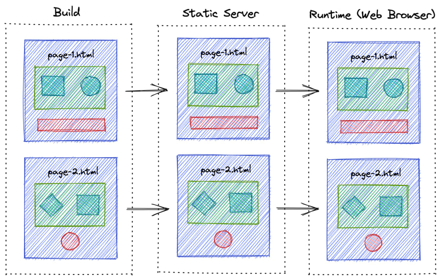 <br>
Pada **Static Site Generation**, halaman-halaman web dibangun pada waktu build time (pembangunan) dan dihasilkan menjadi file HTML, CSS, dan JavaScript yang siap untuk disajikan ke pengguna. Data yang dibutuhkan untuk menghasilkan halaman-halaman tersebut diambil pada waktu build time atau pada saat build process berjalan. Saat pengguna mengakses halaman-halaman tersebut, ia hanya perlu memuat file HTML dan JavaScript yang telah dihasilkan sebelumnya, sehingga waktu muat (loading) halaman menjadi lebih cepat dan kinerja aplikasi web meningkat.

## getStaticProps & getServerSideProps 

`getStaticProps` dan `getServerSideProps` adalah dua fungsi yang disediakan oleh Next.js untuk mengambil data pada waktu pembangunan (build time) dan waktu runtime (runtime) masing-masing.

- getStaticProps <br>
Digunakan untuk mengambil data pada waktu pembangunan (build time), dan hasilnya akan di-cache oleh Next.js dan digunakan untuk setiap permintaan selanjutnya, kecuali ada permintaan data baru yang dilakukan. Fungsi ini cocok digunakan pada halaman yang datanya relatif statis dan tidak berubah terlalu sering, seperti halaman produk pada sebuah toko online.  <br>
Contoh penggunaan getStaticProps:

```tsx
import { GetStaticProps } from 'next';
import { Post } from '../types/post';
import { getPosts } from '../api/posts';

type Props = {
  posts: Post[];
};

const Blog = ({ posts }: Props) => (
  <ul>
    {posts.map((post) => (
      <li key={post.id}>
        <h2>{post.title}</h2>
        <p>{post.body}</p>
      </li>
    ))}
  </ul>
);

export const getStaticProps: GetStaticProps<Props> = async () => {
  const posts = await getPosts();
  return {
    props: {
      posts,
    },
  };
};

export default Blog;

```

Pada contoh di atas, `getStaticProps` digunakan untuk mengambil data dari API (getPosts) dan mengembalikan hasilnya sebagai props ke komponen Blog. `getStaticProps` dijelaskan dengan tipe `GetStaticProps` dan diatur untuk mengembalikan objek dengan properti props.

- getServerSideProps <br>
Digunakan untuk mengambil data pada waktu runtime (runtime), setiap kali permintaan dilakukan oleh pengguna. Fungsi ini cocok digunakan pada halaman yang datanya berubah terlalu sering, seperti halaman dashboard pada sebuah aplikasi web.

```tsx
import { GetServerSideProps } from 'next';
import { useRouter } from 'next/router';
import { User } from '../types/user';
import { getUser } from '../api/users';

type Props = {
  user: User;
};

const Profile = ({ user }: Props) => {
  const router = useRouter();

  if (router.isFallback) {
    return <div>Loading...</div>;
  }

  return (
    <div>
      <h1>{user.name}</h1>
      <p>{user.email}</p>
    </div>
  );
};

export const getServerSideProps: GetServerSideProps<Props> = async ({ params }) => {
  const { id } = params;
  const user = await getUser(id);
  return {
    props: {
      user,
    },
  };
};

export default Profile;

```

Pada contoh di atas, `getServerSideProps` digunakan untuk mengambil data pengguna dari API (getUser) berdasarkan id yang diberikan dalam parameter, dan mengembalikan hasilnya sebagai props ke komponen Profile. `getServerSideProps` dijelaskan dengan tipe `getServerSideProps` dan diatur untuk mengembalikan objek dengan properti props. Selain itu, komponen Profile juga menggunakan useRouter untuk menangani status fallback dan pengambilan data secara server-side.

# Hands on NextJS with Typescript and TailwindCSS
## Inisiasi Proyek
1. Buka laman [GitHub](https://github.com/) kalian, lalu create new repository <br>
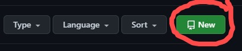
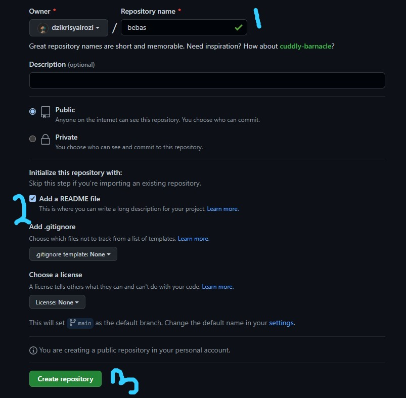
2. Clone Repository tersebut dan buka menggunakan Text Editor anda <br>
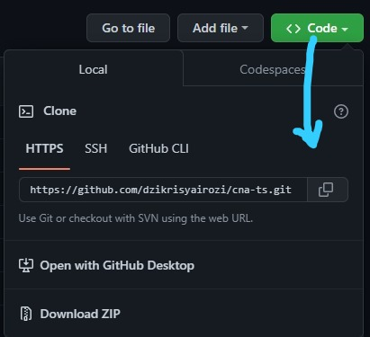 <br>
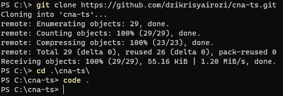
3. Tampilan yang seharusnya kalian lihat ( menggunakan Visual Studio Code ). <br>
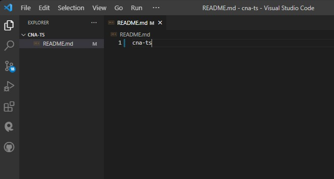

4. Hapus file README.md (jika ada), buka terminal dan jalankan Command dibawah ini untuk menginisiasi NextJs application
```
npx create-next-app@latest
# or
yarn create next-app
# or
pnpm create next-app
```

Akan muncul seperti ini pada terminal kalian.

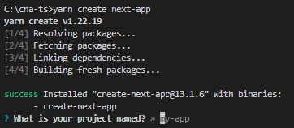

Beri nama atau ketik './' untuk menginstall pada directory kalian sekarang. Press enter lalu akan muncul beberapa pertanyaan: 

```go
√ Would you like to use TypeScript with this project? ... No / `Yes`
√ Would you like to use ESLint with this project? ... No / `Yes`
√ Would you like to use src/ directory with this project? ... No / `Yes`
√ Would you like to use experimental app/ directory with this project? ... `No` / Yes
? What import alias would you like configured? » @/*
```

Pilih Yes untuk semua pertanyaan kecuali experimantal app/, dan tekan enter <br>
Tunggu hingga instalasi selesai

5. NextJS sudah terinisiasi dan berikut tampilan dari struktur directory kalian:<br>

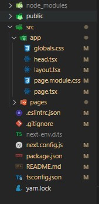 
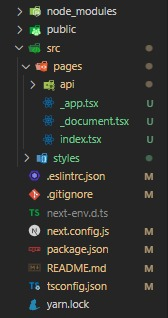

6. Install [Tailwind](https://tailwindcss.com/docs/guides/nextjs) pada Project kalian dengan menjalankan command pada terminal:

```
npm install -D tailwindcss postcss autoprefixer

yarn add -D tailwindcss postcss autoprefixer
```
Tunggu sampai instalasi selesai

7. Generate `tailwind.config.js` and `postcss.config.js` dengan  menjalankan command

```
npx tailwindcss init -p

yarn tailwindcss init -p
```
8. Konfigurasi template path pada `tailwind.config.js`

```js
/** @type {import('tailwindcss').Config} */
module.exports = {
  content: [
    "./app/**/*.{js,ts,jsx,tsx}",
    "./pages/**/*.{js,ts,jsx,tsx}",
    "./components/**/*.{js,ts,jsx,tsx}",
 
    // Or if using `src` directory:
    "./src/**/*.{js,ts,jsx,tsx}",
  ],
  theme: {
    extend: {},
  },
  plugins: [],
}
```

9. Tambahkann tailwind directives pada `globals.css` kalian

```css
@tailwind base;
@tailwind components;
@tailwind utilities;
```

10. Aplikasi sudah bisa dijalankan dengan menjalankan command dibawah ini pada terminal:

```
npm install

yarn / yarn install
```
lalu

```
npm run dev

yarn dev
```
Secara default, aplikasi akan berjalan pada [http://localhost:3000](http://localhost:3000)


## [Struktur File ( New Next with App directory )](https://www.youtube.com/watch?v=LT2xW6FpCNY&list=PLbVhZXO7113G-omiOz7c3i7i7NP37MikS&index=1&t=3961s)
## Simple Page App
1. Layout
2. Content
## Modularisasi

# Challenge Buat Kalian!
1. Membuat Landing Page sebuah website menggunakan NextJS. <br>
*Tidak ada batasan, buat se-kreatif dan se-menarik mungkin 
2. Mengimplementasikan service yang diajarkan pada modul 1 <br>
*Diperbolehkan untuk Improvisasi ( dalam scope materi modul 1 )


# Referensi