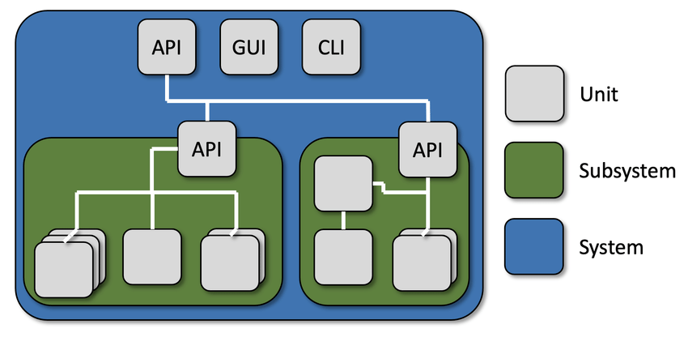
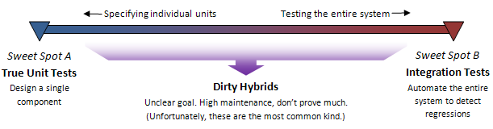

# Pertemuan 4

# Table of contents

- [Introduction](#)
    - [What is unit testing?](#)
    - [Why is unit testing important?](#)
    - [Benefits of unit testing](#)
- [Environment Setup](#)
    - [Overview of Jest, React Testing Library](#)
    - [Configuring the testing framework](#)
- [Writing Unit Tests with Jest and React Testing Library](#)
    - [Basic unit tests using Jest](#)
    - [Testing components and pages in NextJS using React Testing Library](#)
    - [Testing API endpoints with Jest and mocking dependencies](#)
- [Best Practices for Unit Testing](#get-started)
    - [Writing maintainable and reliable unit tests](#)
    - [Choosing the right test cases](#)
    - [Using test coverage tools](#)
- [Deployment](#)
    - [What is the Deployment?](#)
    - [Why would We Deploy?](#)
    - [When to Deploy?](#)
    - [Where to Deploy?](#)
    - [Who can Deploy?](#)
    - [How to Deploy?](#)
- [Conclusion](#)
    - [Recap of key concepts](#)
    - [Next steps in learning unit testing in a NextJS and TypeScript environment using Jest and React Testing Library](#)
- [Challenge](#challenge)


## **Introduction**


### **What is unit testing?**

Unit testing is a technique used by software developers to test their code in small pieces, known as "units". A unit can be a single function, method, or even a small section of code. The goal of unit testing is to verify that each unit of code is working correctly and producing the expected output, as specified by the developer.



By testing small units of code in isolation, developers can catch bugs and errors early in the development process, before they become more complex and costly to fix. This helps to ensure that the final product is of higher quality and meets the requirements of the users. Overall, unit testing is an essential practice for building reliable and robust software applications.

### **Why is unit testing important?**


Unit testing is important for several reasons:

1. **Helps catch bugs early**: By testing each unit of code in isolation, developers can catch bugs and errors early in the development process, before they become more complex and costly to fix. This helps to ensure that the final product is of higher quality and meets the requirements of the users.

2. **Increases confidence in the code**: Unit testing helps developers to be more confident in the code they write. If all the unit tests pass, developers can be more confident that their code works as expected.

3. **Facilitates code changes**: Unit tests can be run quickly and easily, allowing developers to make changes to the codebase without worrying about breaking other parts of the application. This facilitates code changes and refactoring, making it easier to maintain and update the codebase over time.

4. **Improves code quality**: Unit tests help to improve the quality of the code by ensuring that each unit of code is tested thoroughly and meets the requirements or specifications.

5. **Reduces development costs**: Catching bugs and errors early in the development cycle helps to reduce development costs by minimizing the time and effort required to fix issues later on in the process. Overall, unit testing is an essential practice for building reliable and robust software applications.

## **Environment Setup**

### **Overview of Jest, React Testing Library, and Cypress**
Jest, React Testing Library, and Cypress are popular testing frameworks for JavaScript applications. Here's a brief overview of each of these frameworks:

1. **Jest**: Jest is a testing framework developed by Facebook. It is commonly used to test JavaScript code, including React applications. Jest provides a simple and intuitive API for writing tests, and comes with built-in features such as mocking, code coverage reporting, and snapshot testing.

2. **React Testing Library**: React Testing Library is a lightweight testing library that focuses on testing React components in a way that simulates how a user would interact with them. It provides utilities for rendering components and querying the DOM, and encourages testing user interactions rather than implementation details.

3. **Cypress**: Cypress is an end-to-end testing framework that enables you to write and run tests that simulate user interactions with your application. Cypress provides a powerful API for interacting with your application, and allows you to easily test scenarios that involve multiple pages or interactions with APIs.

While Jest and React Testing Library are primarily used for unit testing, Cypress is used for end-to-end testing. Unit testing focuses on testing small units of code in isolation, while end-to-end testing focuses on testing how different parts of an application work together. Together, these testing frameworks provide a comprehensive solution for testing JavaScript applications.

### **Configuring the testing framework**

**Jest**

To install and configure Jest in a Next.js TypeScript environment, you can follow these steps:

1. Install Jest and its required dependencies by running the following command in your terminal:

```
npm install --save-dev jest @types/jest ts-jest babel-jest
```

2. Create a `jest.config.js` file in the root of your project directory. This file should contain configuration options for Jest. Here's an example of what the file could look like:

```tsx
// jest.config.js
const nextJest = require('next/jest')

const createJestConfig = nextJest({
  // Provide the path to your Next.js app to load next.config.js and .env files in your test environment
  dir: './',
})

// Add any custom config to be passed to Jest
/** @type {import('jest').Config} */
const customJestConfig = {
  // Add more setup options before each test is run
  // setupFilesAfterEnv: ['<rootDir>/jest.setup.js'],
  moduleNameMapper: {
    '^@/(.*)$': '<rootDir>/src/$1',
  },
  testEnvironment: 'jest-environment-jsdom',
}

// createJestConfig is exported this way to ensure that next/jest can load the Next.js config which is async
module.exports = createJestConfig(customJestConfig)
```
- This configuration tells Jest to use TypeScript for testing, and to look for test files in the `src` directory.

4. Create a` babel.config.js` file in the root of your project directory. This file should contain configuration options for Babel. Here's an example of what the file could look like:

```tsx
module.exports = {
    presets: ['next/babel', '@babel/preset-typescript'],
};
```

- This configuration tells Babel to use the Next.js preset.

4. Add a script to your package.json file to run Jest. Here's an example of what the script could look like:

```json
{
    "scripts": {
      "test": "jest --config=jest.config.js"
  },
};
```

- That's it! With these steps, you should now have Jest installed and configured for your Next.js TypeScript project. You can now write and run unit tests for your project using Jest.

## **Writing Unit Tests with Jest and React Testing Library**



### **Basic unit tests using Jest**

1. Create a new file called `sum.ts`.

```tsx
export function sum(a: number, b: number): number {
    return a + b;
}
```

2. Create a new file called `__test__/sum.test.ts` on root directory.
```ts
import { sum } from '@/test/sum';

describe('sum function', () => {
  it('should add two numbers together', () => {
    expect(sum(1, 2)).toEqual(3);
  });
});
```
3. Run
```bash
npm run test

or

yarn test
```

4. It should shows something like this.
```lua
Test Suites: 1 passed, 1 total
Tests:       1 passed, 1 total
Snapshots:   0 total
Time:        0.667 s
Ran all test suites.
Done in 0.60s.
```

### **Testing components and pages in NextJS using React Testing Library**

#### **Component**

1. Testing `ButtonLink.tsx` component.
    - Create `ButtonLink.test.tsx`
    ```tsx
    import React from 'react';
    import { render, screen } from '@testing-library/react';
    import ButtonLink from '@/components/ButtonLink';
    import '@testing-library/jest-dom';

    describe('ButtonLink component', () => {
      it('renders button with link and title', () => {
        const title = 'Example Button';
        const link = 'https://example.com';
        render(<ButtonLink link={link} title={title} />);
        const buttonLinkElement = screen.getByRole('button');
        const anchorElement = screen.getByRole('link');

        expect(buttonLinkElement).toBeInTheDocument();
        expect(buttonLinkElement).toHaveTextContent(title);
        expect(anchorElement).toHaveAttribute('href', link);
      });
    });
    ```
    - The test case renders the `ButtonLink `component with specified props, then uses the `'screen'` object from the React Testing Library to locate the button and anchor elements. It uses Jest's `'expect'` function to check if the button element is in the document, if it has the expected text content, and if the anchor element has the expected `href` attribute.

2. Testing `Poster.tsx` component.
    - Create `Poster.test.tsx`
    ```tsx
    const sampleProps = {
      id: 1,
      link: '/',
      poster_path: 'https://via.placeholder.com/256x384.png',
      title: 'Sample Poster',
      release_date: '2022-01-01',
      overview: 'A sample movie poster',
    };

    describe('Poster component', () => {
        it('renders correct poster and link with title, release date and overview', () => {
            const { getByAltText, getByRole, getByText } = render(<Poster {...sampleProps} />);
            const posterImg = getByAltText(`${sampleProps.title} Poster`);
            const posterLink = getByRole('link');
            const title = getByText(sampleProps.title);
            const releaseDate = getByText(sampleProps.release_date);
            const overview = getByText(sampleProps.overview);
          
            expect(posterImg).toHaveAttribute("src", "/_next/image?url=https%3A%2F%2Fvia.placeholder.com%2F256x384.png&w=640&q=75");
            expect(posterLink).toHaveAttribute('href', sampleProps.link);
            expect(title.textContent).toBe(sampleProps.title);
            expect(releaseDate.textContent).toBe(sampleProps.release_date);
            expect(overview.textContent).toBe(sampleProps.overview);
          });
    });
    ```
    - This test will ensure that the Poster component renders the correct poster image and link along with the `title`, `release_date`, and `overview` props.


#### **Pages**

Testing `pages/index.tsx`

1. Create `__test__/pages/index.test.tsx`
```tsx
import { render, screen } from "@testing-library/react";
import Home from "@/pages/index";
import '@testing-library/jest-dom';

describe("Home", () => {
    it('should render the correct title', () => {
        const { getByRole } = render(<Home />);
        const title = getByRole('heading', { level: 1 });
        expect(title).toHaveTextContent('Demo');
      });
    
      it('should render the Hero section', () => {
        render(<Home />);
        const heroSection = screen.getByTestId('hero-section');
        expect(heroSection).toBeInTheDocument();
      });

});
```
- In this example, we're testing the following:
  - The page should have the correct title.
  - The hero section should be rendered.

### **Testing API endpoints with Jest and mocking dependencies**

Lets try verifies that the MoviesPage  renders the list of popular movies correctly, as well as the Popular Movies text and movie posters from TMDb API endpoint.

1. Imports the necessary functions and components from the React Testing Library, React Query, and the MoviesPage component.
```tsx
import { render, waitFor } from "@testing-library/react";
import { QueryClientProvider, QueryClient } from "react-query";
import MoviesPage from "@/pages/movies";
import '@testing-library/jest-dom';
```
2. Imports the `getPopularMovies` function from the page's API directory and mocks it using Jest's `'jest.mock'` function.
```tsx
import { getPopularMovies } from "@/pages/api/rq-tmdb";

jest.mock("@/pages/api/rq-tmdb");
```
3. Defines a '`describe`' block that groups together the tests for the `MoviesPage` component.
```tsx
describe("MoviesPage", () => {
  
});
```
4. Defines an '`it`' block that tests if the `MoviesPage` component renders the list of popular movies correctly.
```tsx
  it("should render the list of popular movies", async () => {

  });
```
5. Creates a new instance of the `QueryClient` component from React Query and defines a sample '`movies`' object that contains an array of movies with their respective data.
```tsx
const queryClient = new QueryClient();
    const movies = {
      results: [
        {
          id: 1,
          title: "Movie 1",
          poster_path: "/poster1.jpg",
          release_date: "2021-01-01",
          overview: "Overview 1",
        },
        {
          id: 2,
          title: "Movie 2",
          poster_path: "/poster2.jpg",
          release_date: "2021-02-01",
          overview: "Overview 2",
        },
      ],
    };
```
6. Mocks the `getPopularMovies` function to resolve with the sample` 'movies'` object.
```tsx
(getPopularMovies as jest.Mock).mockResolvedValueOnce(movies);
```
7. Uses the '`render`' function from the React Testing Library to render the MoviesPage component wrapped in the `QueryClientProvider` component.
```tsx
    const { getByText } = render(
      <QueryClientProvider client={queryClient}>
        <MoviesPage />
      </QueryClientProvider>
    );
```
9. Uses the '`waitFor`' function from the React Testing Library to wait for the Popular Movies text to be displayed on the page.
10. Uses the '`getByText`' function from the React Testing Library to get the paragraph element that contains the Popular Movies text and checks if it is in the document.
```tsx
    await waitFor(() => {
      expect(getByText((content, element) => {
        return element?.tagName.toLowerCase() === "p" && element.textContent === "Popular Movies"
      })).toBeInTheDocument();
    });
```
11. Uses Promise.all to create an array of Promises that resolve to the poster images for each movie in the '`movies`' object.
12. Uses the '`waitFor`' function from the React Testing Library to wait for each movie poster to be displayed on the page.
13. Uses the '`getByText`' function from the React Testing Library to get the movie poster element for each movie and checks if they are in the document.
```tsx
    const posters = await Promise.all(
      movies.results.map((movie: any) => {
        return waitFor(() => {
          return getByText(movie.title);
        });
      })
    );
```
14. Uses Jest's 'expect' function to make assertions about the expected values of the Popular Movies text and movie posters.
```tsx
expect(posters).toHaveLength(2);
```
  - Specifically, the assertions check if the Popular Movies text is in the document and if the number of movie posters displayed on the page matches the number of movies in the sample 'movies' object.

## **Best Practices for Unit Testing**
Unit testing is an essential part of software development. It helps to identify defects early in the development cycle and reduces the cost of fixing defects later. [Here](https://gist.github.com/dzikrisyairozi/e6005338cc79cd805f36be5898122bec) are some best practices for unit testing:

### **Writing maintainable and reliable unit tests**
Unit tests are a critical part of software development. They help ensure that code is correct, maintainable, and reliable. [Here](https://gist.github.com/dzikrisyairozi/e5b0217d84008f81ab77228a98c971e9#file-maintableunittest-md) are some tips for writing maintainable and reliable unit tests:
### **Choosing the right test cases**
Choosing the right test cases is crucial for ensuring the quality of software. [Here](https://gist.github.com/dzikrisyairozi/e5b0217d84008f81ab77228a98c971e9#file-righttestcase-md) are some tips for choosing the right test cases:
### **Using test coverage tools**
Test coverage tools are a valuable resource for ensuring that your code is thoroughly tested. These tools help you identify which parts of your code are covered by your tests and which parts are not. [Here](https://gist.githubusercontent.com/dzikrisyairozi/e5b0217d84008f81ab77228a98c971e9/raw/a87b80f28ac4ad57a556add2168cf3f8ebee69d9/testCoverageTools.ts) are some tips for using test coverage tools effectively:

## **Deployment**
### **What is the Deployment?**
Deploying a website involves copying the website's files and data from a local development environment to a production server. This process can include configuring web servers, setting up databases, and configuring any necessary software dependencies. The deployment process can vary depending on the technology stack used to build the website, the hosting provider, and the requirements of the project.
### **Why would We Deploy?**
We deploy a website so that people can access it through their web browsers from anywhere in the world. By deploying a website, we make it available on the internet and enable users to interact with its content. This is important because it allows businesses and individuals to reach a wider audience, share information and services, and build an online presence. 
### **When to Deploy?**
We deploy a website when it is ready to be published and made available to the public. This typically occurs after the website has been designed, developed, and thoroughly tested in a staging environment. The staging environment is a test environment that closely resembles the production environment, but is not publicly accessible. Once the website has been tested in the staging environment and any issues have been resolved, it is ready for deployment.
### **Who can Deploy?**
Website deployment can be performed by anyone who has the necessary skills and access to the website's hosting environment. Typically, website deployment is performed by web developers, system administrators, or DevOps engineers who have experience with the technologies and tools used to build and deploy websites.

In some cases, website owners or content creators may also perform deployment tasks, such as updating content or uploading files to the hosting environment. However, more complex deployment tasks, such as configuring servers or setting up databases, are usually left to professionals with specialized skills.
### **Where to Deploy?**
NextJS applications can be deployed to a variety of hosting platforms. Here are some popular options:

1. **Vercel**: Vercel is a cloud hosting platform that specializes in hosting Next.js applications. It offers features such as automatic deployments, serverless functions, and built-in analytics.

2. **Heroku**: Heroku is a cloud platform that supports many programming languages, including Node.js. It offers easy deployment through its web interface or command-line interface.

3. **AWS**: Amazon Web Services (AWS) is a cloud platform that offers a range of services for hosting applications. It supports various deployment options for Next.js applications, such as AWS Elastic Beanstalk or AWS Lambda.

4. **Google Cloud Platform**: Google Cloud Platform offers several services for hosting Next.js applications, including App Engine, Compute Engine, and Kubernetes Engine.

5. **Netlify**: Netlify is a popular platform for deploying static websites and offers built-in features for hosting Next.js applications. It offers easy deployment and continuous integration with GitHub or GitLab.

These are just a few options for hosting Next.js applications. The choice of hosting platform will depend on factors such as budget, scalability requirements, deployment needs, and the level of support required.
### **How to Deploy?**
Deploying a Next.js website to Vercel is a straightforward process that involves a few steps:
1. Create a Vercel account: If you haven't already, create an account on Vercel's website.
2. Install the Vercel CLI: The Vercel CLI is a command-line tool that allows you to deploy your Next.js application to Vercel. Install it by running the following command in your terminal:
```lua
npm install -g vercel
```
3. Connect your Next.js application to Vercel: Navigate to your Next.js project directory in the terminal and run the following command:
```lua
vercel login
```
- Follow the prompts to log in to your Vercel account and link your project.
4. Deploy your Next.js application: To deploy your application to Vercel, run the following command in your terminal:
```lua
vercel
```
- This will start the deployment process, which may take a few minutes. Once the deployment is complete, you'll be given a URL where you can access your website.

### or

<br>
You can also set up automatic deployments on Vercel by connecting your project to a Git repository and configuring a deployment trigger.
<br>

## **Conclusion**

### **Recap of key concepts**
  - Basic unit tests using Jest
  - Testing components and pages in NextJS using React Testing Library
  - Testing API endpoints with Jest and mocking dependencies
  - Deployment
### **Next steps in learning unit testing in a NextJS and TypeScript environment using Jest and React Testing Library**
- Read Documentation **!always**

## **Challenge**

